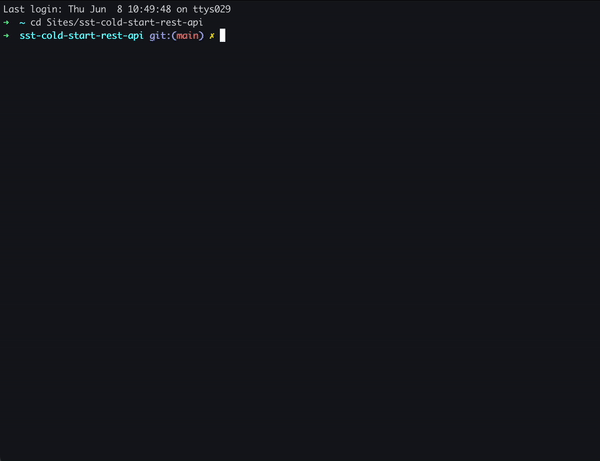

# ❄️ Cold start tool ❄️

## Introduction:

---
The Cold Start Tool is a utility designed to analyze pre-built AWS Lambdas and mitigate cold start duration. Cold start duration can result in user experience issues, such as lengthy page loading times. By optimizing the size of the lambda build, you can reduce cold start duration and improve overall performance.

### Features

- `Lambda Size Analysis`: The Cold Start Tool examines the file size of AWS Lambdas and identifies if the build is not compacted.
- `Library Usage`: It identifies the three most frequently utilized or imported libraries in the Lambda function.
- `Metrics Generation`: The tool generates metrics for all analyzed Lambdas, allowing you to monitor their sizes and track improvements over time.
- `Threshold Errors`: If a Lambda's size exceeds a specified threshold, the tool generates an error, indicating the need for optimization.
- `SST Framework Optimization`: The default configuration of the Cold Start Tool is optimized for the [SST framework](https://sst.dev/), making it easy to integrate and use within your projects.

### [About cold start duration](https://docs.aws.amazon.com/lambda/latest/operatorguide/execution-environments.html#cold-start-latency)


The chart illustrates the correlation between lambda build size and cold start duration. As the lambda build size increases, the cold start duration also tends to be longer. This relationship highlights the importance of optimizing the lambda build size to reduce cold start latency and enhance overall performance.

Our mission is to minimize cold start duration and improve user experience. One of the most effective practices we recommend is optimizing your lambda build size
<table>
<tr><th>Lambda build size</th><th>Cold start duration</th></tr>
<tr><td>1 MB</td><td>150 ms</td></tr>
<tr><td>19.6 MB</td><td>692 ms</td></tr>
<tr style='color:red;'><td>30.2 MB</td><td>1716 ms</td></tr>
<tr style='color:red;'><td>52.8 MB</td><td>2515 ms</td></tr>
</table>

Here some [examples](https://docs.aws.amazon.com/lambda/latest/operatorguide/static-initialization.html) how to optimize your lambda imports:

```
// Instead of const AWS = require('aws-sdk'), use:
const DynamoDB = require('aws-sdk/clients/dynamodb')

// Instead of const AWSXRay = require('aws-xray-sdk'), use:
const AWSXRay = require('aws-xray-sdk-core')

// Instead of const AWS = AWSXRay.captureAWS(require('aws-sdk')), use:
const dynamodb = new DynamoDB.DocumentClient()
AWSXRay.captureAWSClient(dynamodb.service)
```

## Usage

---

### Icons:

- ✅ - `SUCCESS` / The lambda build size is lower than the error threshold
- 🚧 - `WARNING` / The lambda build size is within 10% of the error threshold
- ❌ - `ERROR` / The lambda build size is higher than error threshold


### Installation:

```
npm install @theapexlab/cold-start-tool --save-dev
```

### Run:

```
npx cst
```
or 
```
npm run cst
```

### Uninstall:

```
npm uninstall @theapexlab/cold-start-tool
```

## Behind the scenes

---

Upon first run, it creates a `cst-config.json` with the default settings for SST in the root of the project.

If the lambda is not minified on build time the imported node-modules are commented like this ` // node_modules/...` , so this app basically counts the occurrences of the same imports, and if the file size is over 20MB (can be changed in `cst-config.json`) the developer gets an error, and the three most used libs in the lambda.

## Configuration

---

The configuration file `cst-config.json` can be found at the root of the project. Here you can change a few things:

- `buildPath`: default folder where the built lambdas are located
- `searchTerm`: the start of the node_module comments to find
- `errorThresholdMB`: the maximum acceptable size of the lambda in megabytes
- `showOnlyErrors`: show only the files that exceed the error threshold
- `filterByName`: searchfilter for files
- `detailedReport`: gives you a detailed report and the end

## Custom arguments

---

Search for something specific in a lambda's name:

```
npx cst --filterByName=get
```

Overwrite the error threshold:

```
npx cst --errorThresholdMB=30
```

To show only the files that exceed the error threshold:

```
npx cst --showOnlyErrors
```

To run a detailed report:

```
npx cst --detailed-report
```

To see all available options:

```
npx cst --help
```

## Support
---
### Ask a question
If you have any questions or need clarification about CST, feel free to ask in the repository. Other community members and maintainers can provide insights, solutions, and guidance to help you out.

[👉 Ask a question](https://github.com/theapexlab/cold-start-tool/discussions)

### Create a bug report
 Encountered an error or facing an issue with CST? Make sure to create a bug report. By reporting bugs, you contribute to the improvement of the tool and help the maintainers identify and address any problems.

[👉 Create bug report](https://github.com/theapexlab/cold-start-tool/issues/new?labels=bug)

### Submit a feature request
Have a brilliant idea for a new feature or enhancement in CST? Submit a feature request to share your suggestions with the community. It's an opportunity to shape the future of the tool and contribute to its growth.

[👉 Submit feature request](https://github.com/theapexlab/cold-start-tool/issues/new?labels=feature)