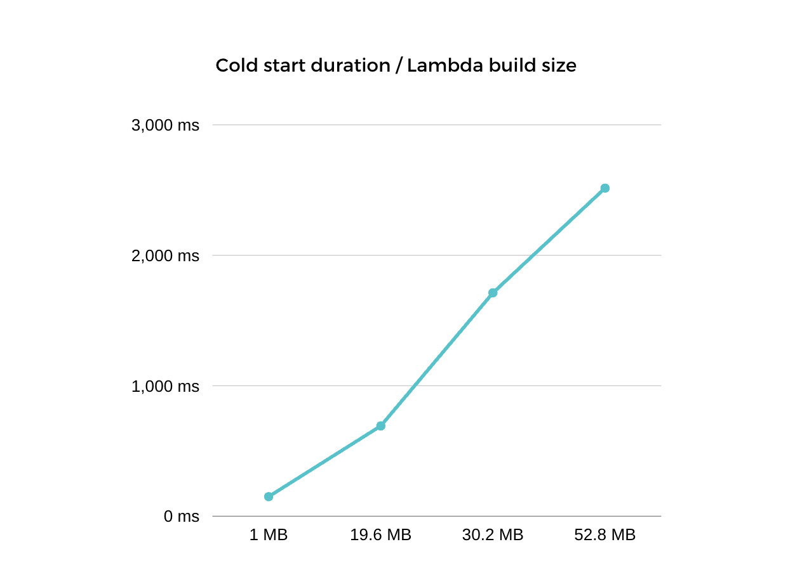

# ❄️ Cold start tool ❄️

## Introduction:

---

This tool is designed to analyze built AWS Lambdas. It can check the file size of the Lambdas and, if the build is not minified, it can identify the three most used/imported libraries in the Lambda function and also creates metrics about all of the Lambdas. If the size of the Lambda exceeds a specified threshold, a warning will be generated. Our default config is optimized for [SST framework](https://sst.dev/).

### [About cold start duration](https://docs.aws.amazon.com/lambda/latest/operatorguide/execution-environments.html#cold-start-latency)



<p>As you can see the larger lambda build size cause a longer cold start duration. Our mission is to reduce the cold start duration and one of the best practices if you reduce your lambda build size.</p>
<table>
<tr><th>Lambda build size</th><th>Cold start duration</th></tr>
<tr><td>1 MB</td><td>150 ms</td></tr>
<tr><td>19.6 MB</td><td>692 ms</td></tr>
<tr style='color:red;'><td>30.2 MB</td><td>1716 ms</td></tr>
<tr style='color:red;'><td>52.8 MB</td><td>2515 ms</td></tr>
</table>

Here some [examples](https://docs.aws.amazon.com/lambda/latest/operatorguide/static-initialization.html) how to optimize your lambda imports:

```
// Instead of const AWS = require('aws-sdk'), use:
const DynamoDB = require('aws-sdk/clients/dynamodb')

// Instead of const AWSXRay = require('aws-xray-sdk'), use:
const AWSXRay = require('aws-xray-sdk-core')

// Instead of const AWS = AWSXRay.captureAWS(require('aws-sdk')), use:
const dynamodb = new DynamoDB.DocumentClient()
AWSXRay.captureAWSClient(dynamodb.service)
```

## Usage

---

Installation:

```
npm install @theapexlab/cold-start-tool --save-dev
```

Run:

```
npm run cst
```

Uninstall:

```
npm uninstall @theapexlab/cold-start-tool
```

## Behind the scenes

---

Upon first run, it creates a `cst-config.json` with the default settings for SST in the root of the project.

If the lambda is not minified on build time the imported node-modules are commented like this ` // node_modules/...` , so this app basically counts the occurrences of the same imports, and if the file size is over 20MB (can be changed in `cst-config.json`) the developer gets a warning, and the three most used libs in the lambda.

## Configuration

---

The configuration file `cst-config.json` can be found at the root of the project. Here you can change a few things:

- `buildPath`: default folder where the built lambdas are located
- `searchTerm`: the start of the node_module comments to find
- `warningThresholdMB`: the maximum acceptable size of the lambda in megabytes
- `showOnlyErrors`: show only the files that exceed the warning threshold
- `filterByName`: searchfilter for files
- `detailedReport`: gives you a detailed report and the end

## Custom arguments

---

Search for something specific in a lambda's name:

```
npm run cst --filterByName=get
```

Overwrite the warning threshold:

```
npm run cst --warningThresholdMB=30
```

To show only the files that exceed the warning threshold:

```
npm run cst --showOnlyErrors
```

To run a detailed report:

```
npm run cst --detailed-report
```

To see all available options:

```
npm run cst --help
```
